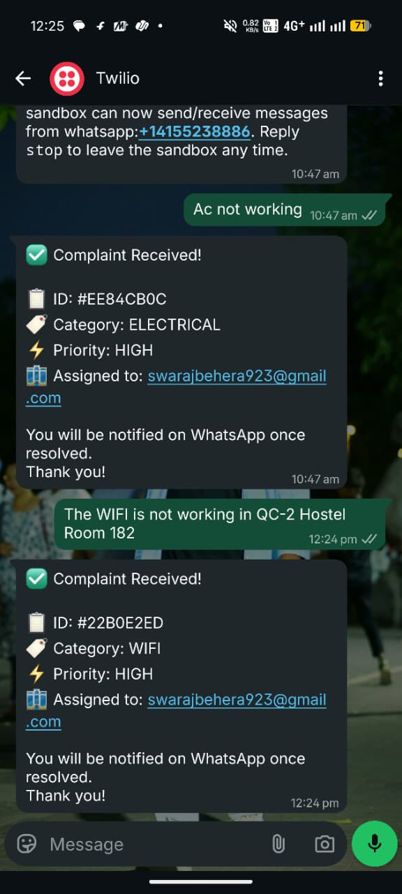
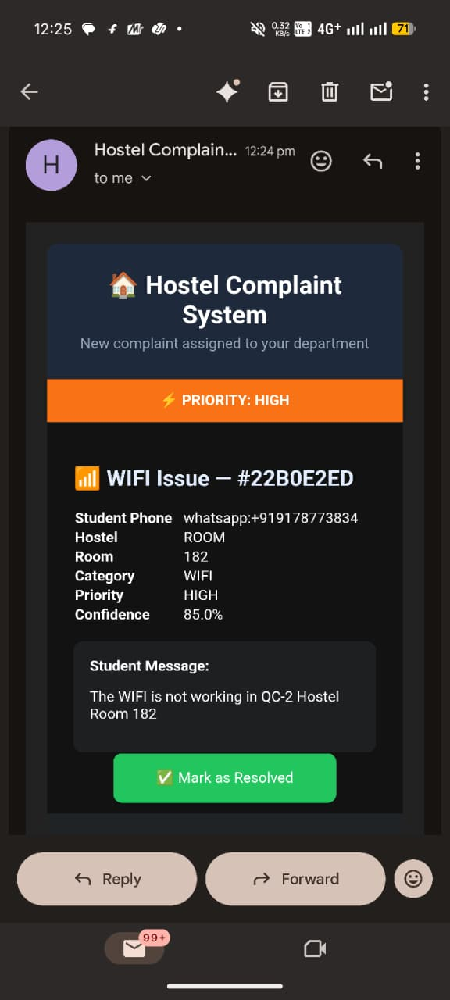
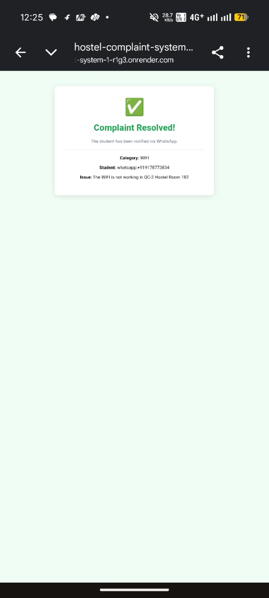
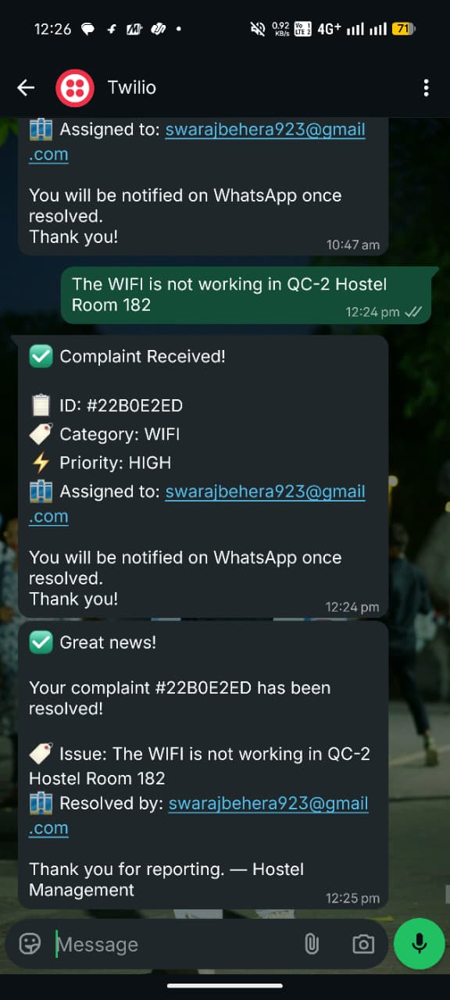

# 🏠 Smart Hostel Complaint Management System

[](LICENSE)
[](https://python.org)
[](https://flask.palletsprojects.com)
[](../../actions)
[](CONTRIBUTING.md)

> AI-powered WhatsApp complaint management for university hostels.  
> Student texts a problem → AI classifies it → Department gets an email → One click resolves it → Student is notified.  
> **No app. No forms. Just WhatsApp.**

---

## 📖 Contents

- [Problem](#-problem)
- [Demo](#-demo)
- [Features](#-features)
- [Tech Stack](#-tech-stack)
- [Architecture](#-architecture)
- [Quick Start](#-quick-start)
- [Project Structure](#-project-structure)
- [Roadmap](#-roadmap)
- [Contributing](#-contributing)
- [Team](#-team)
- [License](#-license)

---

## 🎯 Problem

Every university hostel has a paper complaint register. Students walk to the warden's
office, write their issue, and then hear nothing for days. There's no tracking, no
acknowledgement, no accountability. Complaints get lost, repeated, or simply ignored.

**Average resolution time: 5–7 days. Our target: under 24 hours.**

---

## 🎬 Demo

**Student sends:**
```
KP-7 hostel room 312 fan not working urgent
```

**System replies instantly:**
```
✅ Complaint Received!

📋 ID: #A3F8C201
🏷️ Category: ELECTRICAL
⚡ Priority: URGENT
🏢 Assigned to: electrical@university.edu

You will be notified on WhatsApp once resolved. Thank you!
```

**Electrical department receives** a formatted HTML email with a green "✅ Mark as Resolved" button.

**When they click it, the student gets:**
```
✅ Great news!

Your complaint #A3F8C201 has been resolved!

🏷️ Issue: KP-7 hostel room 312 fan not working urgent
🏢 Resolved by: electrical@university.edu

Thank you for reporting. — Hostel Management
```

**Live deployment:** [https://hostel-complaint-system-1-r1g3.onrender.com](https://hostel-complaint-system-1-r1g3.onrender.com)

---


## 📸 Screenshots

### Student sends complaint → Instant WhatsApp reply


### Department receives email with one-click resolve


### Department clicks resolve → Confirmation page


### Student receives resolution notification


---

## ✨ Features

- **📱 WhatsApp-native** — No app download. No training needed for students.
- **🤖 AI Classification** — 8 complaint categories, detected automatically.
- **⚡ Priority Detection** — URGENT / HIGH / MEDIUM detected from keywords.
- **📍 Smart Extraction** — Detects KP-7, Block A, Room 312 from natural text.
- **🏢 Auto-routing** — Correct department emailed instantly.
- **📧 Rich HTML Emails** — Colour-coded priority, full details, one-click resolve.
- **✅ One-Click Resolution** — Department resolves directly from email, no login needed.
- **📲 Auto-Reply on Resolve** — Student notified on WhatsApp when fixed.
- **💾 Full Audit Trail** — Every complaint tracked in PostgreSQL with timestamps.
- **🔒 Secure Tokens** — Cryptographic one-time tokens prevent fake resolutions.

---

## 🛠️ Tech Stack

| Layer | Technology |
|---|---|
| Backend | Flask (Python 3.8+) |
| Messaging | Twilio WhatsApp Business API |
| AI/NLP | Keyword classifier (no external API, zero latency) |
| Database | PostgreSQL via Supabase |
| Email | Resend API |
| Deployment | Render + render.yaml |
| Monitoring | UptimeRobot (keep-alive) |
| CI/CD | GitHub Actions |

---

## 🏗️ Architecture

```
Student (WhatsApp)
      │
      ▼
Twilio API ──POST /webhook──▶ Flask (app.py)
                                    │
                          ┌─────────┴──────────┐
                          ▼                    ▼
               ai_classifier_simple.py    database.py
               (classify complaint)       (save to Supabase)
                          │
                          ▼
                     email_sender.py
                   (Resend API → dept)
                          │
                 Department clicks resolve
                          │
                   GET /resolve ──▶ Flask
                                      │
                               ┌──────┴──────┐
                               ▼             ▼
                          database.py    Twilio API
                          RESOLVED     (notify student)
```

Full diagram → [docs/ARCHITECTURE.md](docs/ARCHITECTURE.md)

---

## 🚀 Quick Start

```bash
git clone https://github.com/YOUR_USERNAME/smart-hostel-complaint-system.git
cd smart-hostel-complaint-system

python -m venv venv
venv\Scripts\activate        # Windows
# source venv/bin/activate   # Mac/Linux

pip install -r requirements.txt
cp .env.example .env
# Edit .env with your credentials

python src/app.py
```

Full guide → [docs/INSTALLATION.md](docs/INSTALLATION.md)

---

## 📂 Project Structure

```
smart-hostel-complaint-system/
│
├── src/
│   ├── app.py                   # Flask server — all HTTP routes
│   ├── ai_classifier_simple.py  # Keyword NLP classifier
│   ├── database.py              # Supabase database operations
│   └── email_sender.py          # Resend HTML email notifications
│
├── tests/
│   ├── test_classifier.py       # 25+ classifier tests
│   ├── test_database.py         # Schema & data validation tests
│   └── test_email.py            # Email content generation tests
│
├── docs/
│   ├── ARCHITECTURE.md          # System design with data flow diagram
│   ├── INSTALLATION.md          # Step-by-step local + Render setup
│   └── PITCH.md                 # Hackathon pitch notes and Q&A prep
│
├── examples/
│   ├── test_messages.txt        # Sample complaints for manual testing
│   └── sample_complaints.json  # Expected classification outcomes
│
├── .github/
│   ├── workflows/ci.yml         # GitHub Actions pipeline
│   ├── ISSUE_TEMPLATE/          # Bug & feature request templates
│   └── PULL_REQUEST_TEMPLATE.md
│
├── render.yaml                  # Render deployment config
├── requirements.txt
├── .env.example                 # Credential template (safe to commit)
├── .gitignore
├── .gitattributes
├── README.md
├── CONTRIBUTING.md
├── CODE_OF_CONDUCT.md
└── ROADMAP.md
```

---

## 🗺️ Roadmap

See [ROADMAP.md](ROADMAP.md) for full details.

**v1.0 — Current (Hackathon MVP)**
- ✅ WhatsApp via Twilio sandbox
- ✅ Keyword NLP — 8 categories, KP-7/Block/Kaveri formats
- ✅ Auto-routing via Resend email
- ✅ One-click resolution from email
- ✅ Student WhatsApp notification on resolve
- ✅ Supabase audit trail + secure tokens
- ✅ Deployed on Render with render.yaml

**v1.1 — Planned**
- 🔄 Groq LLM classification (API key already in requirements.txt)
- 🔄 Hindi language keyword support
- 🔄 Image/photo complaint analysis
- 🔄 LOW priority level

**v2.0 — Future**
- 📋 Admin analytics dashboard
- 📱 Department mobile app
- ⏰ Auto-escalation after 24 hours
- 🌐 Multi-campus support

---

## 🤝 Contributing

See [CONTRIBUTING.md](CONTRIBUTING.md) for guidelines.

**Good first issues:**
- Add Hindi keywords to the classifier (`पानी` → PLUMBING, `बिजली` → ELECTRICAL)
- Add screenshots to the README
- Write tests for the FOOD and CLEANLINESS categories
- Implement Groq LLM integration for v1.1

---

## 👥 Team

| Member | Role |
|---|---|
| Member 1 | Backend & API (Flask, routes, webhook) |
| Member 2 | Database & Integration (Supabase, Twilio) |
| Member 3 | AI/ML (Classifier, keyword logic, NLP) |
| Member 4 | DevOps & Email (Render, Resend, monitoring) |

---

## 📜 License

[Apache License 2.0](LICENSE) — free for any university to deploy, fork, or build upon.

---

*Made for university students who deserve faster maintenance. 🏠*
